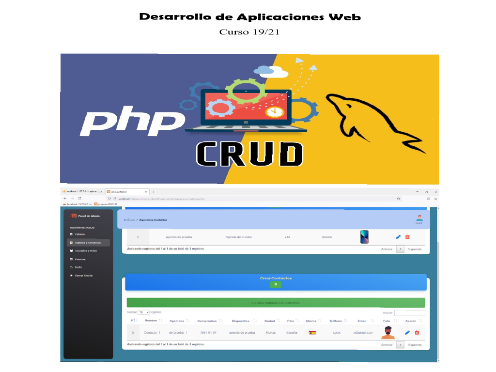

# 🗓️ Proyecto AGENDA DAW

¡Bienvenido al proyecto de AGENDA desarrollado como trabajo final de 2º DAW!  
Este sistema CRUD te permitirá **crear, leer, actualizar y eliminar** contactos o entradas de agenda de forma sencilla.

---

## 📷 Vista previa del proyecto

  

## 🚀 Guía rápida de instalación

Si no tienes ganas de leer todo el `.docx`, aquí va un **resumen express**:

1. ✅ Instala **XAMPP**
2. 🗄️ Importa la base de datos `aplicacion.sql` desde **phpMyAdmin**
3. 🌐 Accede en tu navegador a:  
   `http://localhost/agenda`
4. 🛠️ Usa el sistema **CRUD**: Crear, Leer, Actualizar y Borrar registros.
5. 🔌 El proyecto funciona con el puerto por defecto de XAMPP (80), si lo cambias, ajusta la URL.

---

## 🧪 Sobre los usuarios

- Puedes crear usuarios directamente desde la base de datos.
- **Nota importante**: esta es una versión beta, por lo que **las contraseñas no están cifradas** aún.
- Se puede mejorar fácilmente añadiendo encriptación (bcrypt, hash, etc).

---

## 📄 Documentación completa

La guía detallada del proyecto está en el archivo `.docx` incluido.  
Ahí encontrarás estructura de la base de datos, decisiones técnicas y más.

---

## 🎓 Autor

📌 Este proyecto ha sido realizado como parte del **Grado Superior de Desarrollo de Aplicaciones Web (DAW)** – Curso 2019-2021.

